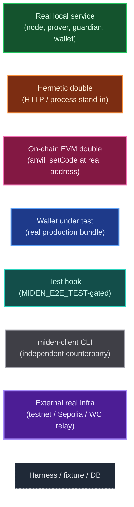
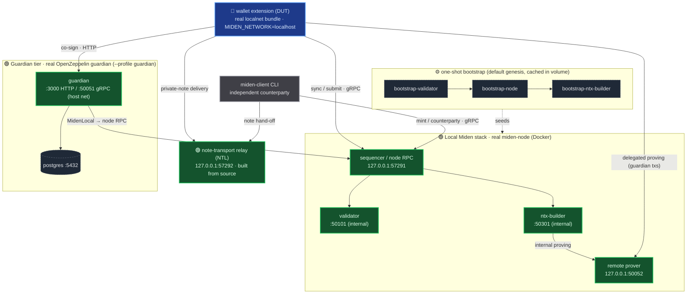
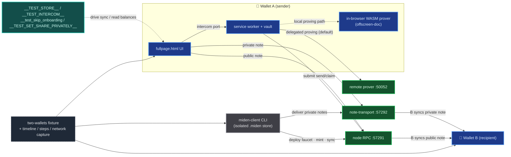
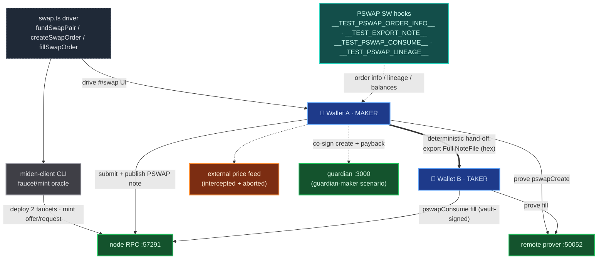
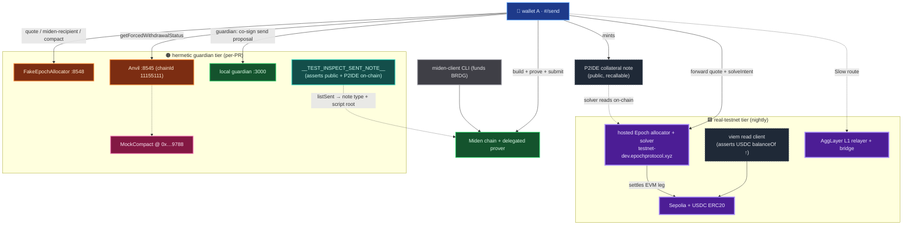
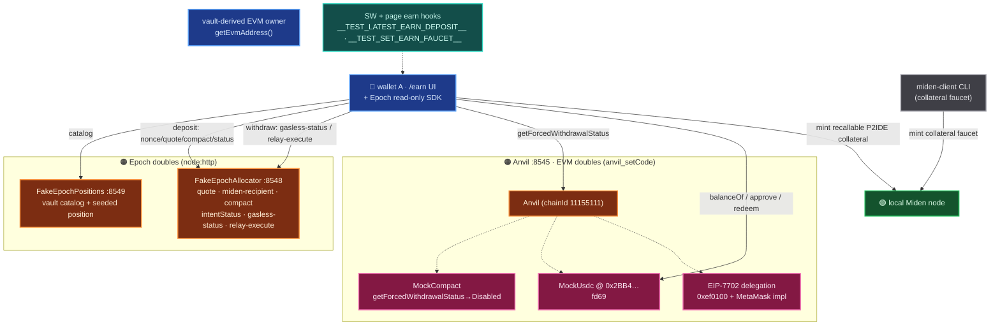
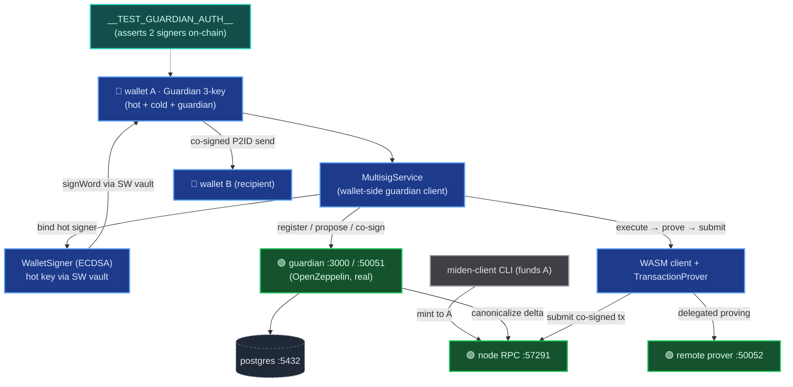
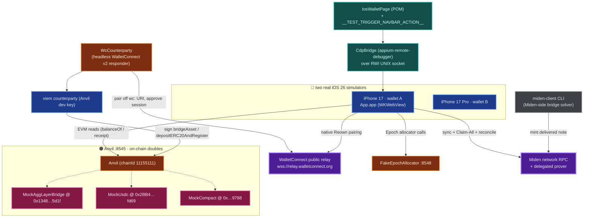

# Miden Wallet — E2E Harness Architecture

> **How we test the wallet against *reality*, not mocks.**
>
> Every per-PR E2E run stands up a **real Miden network** (the actual node binaries in Docker), a **real OpenZeppelin guardian**, a **real Foundry EVM chain**, and drives the **real production wallet bundle** through its **real UI** — no stubbed wallet internals, no fake chain. The only things we fake are the *third‑party, hosted‑only* services we can't legally or physically run in CI (the Epoch allocator/solver, mainnet EVM contracts), and even those are **on‑chain byte‑for‑byte doubles** or **endpoint‑accurate HTTP stand‑ins** deployed at the *same addresses* the production code hardcodes.

This document maps each harness family: what it exercises, every component it touches (real service vs. hermetic double), and the hard problems we solved to make it faithful.

---

## Legend

| Color | Kind | Meaning |
|---|---|---|
| 🟩 green | **Real local service** | The genuine binary/service, run in Docker or from source — no behavior faked |
| 🟧 amber | **Hermetic double** | An HTTP / process stand-in for a hosted-only third party, endpoint-accurate |
| 🟥 pink | **On-chain EVM double** | Real bytecode deployed on Anvil via `anvil_setCode`, at the *production* contract address |
| 🟦 blue | **Wallet under test** | The real production wallet bundle (Chrome MV3 / iOS WKWebView) |
| 🟦 teal | **Test hook** | `MIDEN_E2E_TEST`-gated `window`/SW handle, dead-stripped from prod builds |
| ⬛ slate | **miden-client CLI** | The real Rust client acting as an independent on-chain counterparty/solver |
| 🟪 purple | **External real infra** | Genuine production infra used by the nightly/testnet tier (thick border = "this one is real production") |

---

## Contents

- [The shared substrate — one real Miden network per PR](#the-shared-substrate--one-real-miden-network-per-pr)
- [1 · Core blockchain suite](#1--core-blockchain-suite)
- [2 · Swap / PSWAP (in-protocol DEX)](#2--swap--pswap-in-protocol-dex)
- [3 · Bridge-out (Miden → EVM)](#3--bridge-out-miden--evm)
- [4 · Earn (Epoch lending)](#4--earn-epoch-lending)
- [5 · Guardian co-sign (3-key multisig)](#5--guardian-co-sign-3-key-multisig)
- [6 · iOS bridge-in (EVM → Miden)](#6--ios-bridge-in-evm--miden)
- [Fidelity scorecard](#fidelity-scorecard)

---

## The shared substrate — one real Miden network per PR

Every chrome suite boots the same hermetic-but-real stack from `playwright/e2e/local-stack/docker-compose.local.yml`, with **exact version pins** (`versions.env`) so a gate never drifts with upstream.

**What we solved / built**

- **A full real Miden devnet in Docker, per PR** — validator + sequencer + ntx-builder + remote-prover, bootstrapped from default genesis into a cached volume so reruns skip re-genesis. Not a mock chain — the actual node binaries.
- **The off-chain note-transport relay (NTL)** built from source at a ref whose `miden-protocol` matches the node, so **private-note delivery** between two wallets (and the CLI) works exactly as on testnet.
- **Port choreography** — the remote prover is deliberately published on host `:50052` (not `:50051`) because the host-networked guardian claims `:50051`; the ntx-builder still reaches the prover internally.
- **Exact version pinning** (`versions.env` + a pinned CLI rev in `package.json`) so the gate is reproducible and never floats.
- **Headed-extension Playwright** (Chrome MV3 requires headed mode) run under `xvfb` in CI, `workers:1` + `maxFailures:1` for deterministic, fail-fast signal.

| Component | Kind | Port | Role |
|---|---|---|---|
| sequencer (node RPC) | real service | `57291` | the chain endpoint the wallet + CLI sync/submit against |
| validator | real service | `50101` (internal) | block validation for the sequencer |
| ntx-builder | real service | `50301` (internal) | network notes / network-account txs |
| remote prover | real service | `50052` | delegated proving (guardian txs, ntx-builder) |
| note-transport (NTL) | real service | `57292` | off-chain private-note delivery, built from source |
| guardian | real service | `3000` / `50051` | OpenZeppelin co-signer (Tier-2 profile) |
| postgres | infra | `5432` | guardian state / proposals / signatures |
| miden-client CLI | cli | — | independent counterparty: mint, send, sync |

---

## 1 · Core blockchain suite

Two **fully-isolated Chrome instances** are wallets A and B; the **real Rust `miden-client` CLI** is an independent third party (funds via faucet mints, or acts as counterparty). Everything runs through the **real Send/Claim/onboarding UI**.

| Spec | What it proves |
|---|---|
| `wallet-lifecycle` | onboarding bypass → two distinct wallets → lock/unlock |
| `mint-and-balance` | CLI deploys a faucet + mints public notes → balances land |
| `send-public` | A drives real Send UI → public note → B receives on sync |
| `send-private` | same, `isPrivate` → delivered over the **note-transport layer** |
| `send-public-local-prove` | forces **in-browser WASM proving** (offscreen-doc path) instead of delegating |
| `multi-claim` | CLI mints 3 notes → the drain-loop `claimAllNotes` claims all |
| `multi-account` | second account + account-selector flow |
| `group-claim` | per-faucet grouped claim in the Pending tab |

**What we solved / built**

- **Two independent real wallets + a real CLI counterparty** on one chain — genuine end-to-end value transfer, not a single wallet talking to a mock.
- **Both proving paths covered** — delegated (remote prover) *and* in-browser WASM proving via the offscreen-doc/methods-worker, toggled per spec.
- **Public vs. private note fidelity** — private notes actually traverse the note-transport relay; the harness asserts the recipient discovers them on sync.
- **An observability layer** (timeline + step runner + per-realm network/IndexedDB capture) that demuxes page vs. service-worker vs. worker traffic for post-mortem.

---

## 2 · Swap / PSWAP (in-protocol DEX)

Maker/taker across two real wallets: a maker mints a **PSWAP order note** through the real `#/swap` UI; a taker fills it (full / partial / reverse), cancels + reclaims, and a **guardian-backed maker** co-signs its create + payback.

| Spec | Scenario |
|---|---|
| `swap-full-fill` / `-reverse` | A↔B full fill both directions → lineage `filled`, balances credited |
| `swap-partial-fill` | fill 4 of 10 → order stays active with correct remainder |
| `swap-cancel` | unfilled order locks funds → `cancelSwapOrder` reclaims them |
| `swap-create-guards` | create-form validation (`canProceed`) |
| `swap-guardian` | **guardian maker**: co-signed `pswapCreate` + P2ID payback |
| `swap-smoke` | green-baseline route mount |

**What we solved / built**

- **Deterministic maker→taker hand-off** — a guardian maker's public note commits with canonicalization delay, and the SDK doesn't back-fill a public note committed *before* a reactive taker subscribes to its tag. We solved the race by **exporting the maker's Full `NoteFile` and importing it on the taker** (then consuming by id) — timing-independent, exactly how a live solver reads it from the mempool.
- **SW-side taker hooks** — filling requires the SW vault signer (the page→intercom path yields an empty signature), so `__TEST_PSWAP_CONSUME__` runs *inside the service worker* with the injected vault signer.
- **Guardian maker swaps** — the co-signed `pswapCreate` (mints the maker note) and the P2ID payback claim, proving multisig works through the DEX.
- **On-chain lineage + balance assertions** via SW hooks; the external price feed is intercepted so specs don't depend on a third party.

---

## 3 · Bridge-out (Miden → EVM)

Three specs across **two realism tiers**. The standard-account Fast/Epoch + Slow/AggLayer specs run against **real testnet + real hosted infra** (nightly). The **guardian** Fast/Epoch spec is **fully hermetic** and per-PR.

| Spec | Tier | Flow |
|---|---|---|
| `bridge-out-epoch` | 🟪 real testnet | mint BRDG → Fast route → **real USDC arrives on Sepolia** (read via viem) |
| `bridge-out-agglayer` | 🟪 real testnet | Slow/AggLayer route → Miden-side `bridged-send` row completes |
| `bridge-out-epoch-guardian` | 🟠 hermetic | **guardian** account → asserts the minted collateral note is a **public recallable P2IDE** |

**What we solved / built**

- **A real-value end-to-end assertion** on the nightly tier: bridge out, then read **actual USDC landing on Sepolia** with viem — the strongest possible proof.
- **A hermetic guardian tier** that stands in the fake Epoch allocator + Anvil/MockCompact for the hosted solver, so the guardian bridged-send path is a **per-PR gate** (not just nightly).
- **On-chain note-shape verification** — `__TEST_INSPECT_SENT_NOTE__` reads the committed note's `noteType` and compares its script MAST root to `NoteScript.p2id()/.p2ide()`, asserting **public + P2IDE**. This is the guard that would have caught the private-P2ID guardian bug that shipped.
- **Fresh-sync reclaim height** — the guardian collateral note's absolute reclaim height is measured against a *current* chain head so the remaining recall window can't fall below the allocator's minimum.

---

## 4 · Earn (Epoch lending)

The real `/earn` UI across two flows: a **Miden→Sepolia collateral deposit** (recallable P2IDE, solver-fulfilled EVM leg) and a **gasless EIP-7702 Sepolia→Miden "Smart Withdraw."** Fully hermetic — three programmable doubles.

| Spec | Flow |
|---|---|
| `earn-deposit` | catalog → vault → deposit → mint recallable P2IDE collateral → Epoch confirms |
| `earn-withdraw` | seed a funded position → **gasless 7702 relay** redeem → bridge back → `received` |

**What we solved / built**

- **A multi-endpoint fake allocator** that answers *every* endpoint the Epoch SDK hits on **both** the deposit and withdraw paths (`/checkIfDepositNeeded`, `/miden-recipient`, `/compact`, `/intentStatus`, `/suggested-nonce`, `/gasless-status`, `/relay-execute`) with **programmable** per-leg status — so a spec can drive the intent to `completed` deterministically.
- **"The Compact" stubbed on-chain** at the SDK's hardcoded `COMPACT_ADDRESS` via `anvil_setCode`, returning `getForcedWithdrawalStatus → Disabled` so `solveIntent` proceeds — the one genuine EVM read the deposit makes.
- **A full EIP-7702 gasless withdraw simulation** — 7702 delegation code written at the vault-derived EVM owner (`anvil_setCode`), a Mock USDC, and a fake relayer — reproducing the sponsored redeem without a real relayer or mainnet.
- **Guardian earn deposits** mint the same recallable P2IDE via the shared guardian custom-proposal path.

---

## 5 · Guardian co-sign (3-key multisig)

The full **3-key** path: the device **HOT** key signs, a **real OpenZeppelin guardian** co-signs over HTTP, and the **on-chain multisig** verifies per-procedure thresholds — for both consume and send proposals.

| Spec | Flow |
|---|---|
| `guardian-send-consume` | create a Guardian wallet → fund + **consume** notes (co-signed) → **send** to B (co-signed) → B receives |

**What we solved / built**

- **A real OpenZeppelin guardian backend in Docker** (+ postgres) for **per-PR co-signed E2E** — the actual server-held co-signer, not a mock signature.
- **The complete 3-key handshake** — hot key signs a word via the SW vault, the guardian co-signs over HTTP, the multisig proof is proven (delegated) and the on-chain state verifies; `__TEST_GUARDIAN_AUTH__` asserts two signers landed.
- **Canonicalization handling** — the guardian canonicalizes accepted deltas against the chain; the harness waits it out rather than racing it.
- This is the substrate the guardian **swap**, **bridge**, and **earn** scenarios build on.

---

## 6 · iOS bridge-in (EVM → Miden)

Drives the wallet's **real WKWebView on two real iOS simulators** over a simulator-compatible CDP bridge, exercising **bridge-in** (EVM→Miden): the app's native **Reown** pairs with a **headless WalletConnect counterparty** over the real relay and signs a **real** bridge tx on Anvil.

| Spec | Flow |
|---|---|
| `bridge-in-deposit` | Receive → Cross-Chain → ETH → Slow/AggLayer → confirm → reconciles to `received` |
| `bridge-in-deposit-epoch` | Fast/Epoch: real `depositERC20AndRegister` on Anvil against stubbed Compact+USDC |
| `bridge-in-wc-pairing` | WC-only de-risk: native Reown pairs with the headless counterparty → `connected` |
| `bridge-in-receive` | Miden-leg-only smoke: a delivered note reconciles the bridged-receive row |
| `guardian-send-consume.ios` | the guardian co-sign chain inside the WKWebView |

**What we solved / built**

- **Simulator-compatible CDP** — a bridge over `appium-remote-debugger` on the WebKit RWI UNIX socket to eval JS / click `data-testid` nodes in a real WKWebView (the stock CDP adapters don't work on the simulator).
- **A headless WalletConnect counterparty** that plays the *wallet/responder* side of the **real** WC v2 handshake the app's native Reown initiates — pairing over the genuine public relay, approving an `eip155:11155111` session, then **signing and broadcasting real bridge txs** on Anvil with a viem account.
- **On-chain EVM doubles at production addresses** — the AggLayer unified-bridge, USDC, and The Compact are deployed via `anvil_setCode` at the *exact* addresses the wallet's config hardcodes, so the real `depositERC20AndRegister` path executes unmodified.
- **The native-navbar test trigger** — iOS CTAs ("Claim All", "Continue") render in a `UIWindow` *outside* the WebView where CDP can't reach; `__TEST_TRIGGER_NAVBAR_ACTION__` exposes them.
- **The CLI as the Miden-side bridge solver** — mints the delivered note so the app reconciles the bridged-receive to `received`.

---

## Fidelity scorecard

How close to production each layer runs:

| Layer | In the harness | Real or double? |
|---|---|---|
| **Wallet** | the shipped production bundle (Chrome MV3 / iOS WKWebView), driven through its real UI | 🟦 **real** |
| **Miden chain** | `miden-node` (validator + sequencer + ntx-builder) in Docker | 🟩 **real** |
| **Prover** | `miden-remote-prover` (delegated) *and* in-browser WASM (local) | 🟩 **real** (both paths) |
| **Note transport** | `miden-note-transport` built from source, protocol-matched | 🟩 **real** |
| **Guardian** | OpenZeppelin `guardian` + postgres | 🟩 **real** |
| **Counterparty** | the real Rust `miden-client` CLI | ⬛ **real** (independent) |
| **WalletConnect** | real Reown ↔ real public relay ↔ headless responder | 🟪 real relay + 🟧 responder |
| **EVM chain** | Foundry Anvil at Sepolia's chain-id | 🟧 hermetic (real EVM) |
| **EVM contracts** | AggLayer bridge / USDC / The Compact | 🟥 doubles at **production addresses** |
| **Epoch allocator/solver** | hosted-only third party | 🟪 real (nightly) · 🟧 endpoint-accurate double (per-PR) |
| **EVM settlement (nightly)** | real Sepolia + real USDC, asserted via viem | 🟪 **real** |

> **The short version:** the wallet, the chain, the prover, the note relay, the guardian, and the counterparty are all *real*. We fake only the hosted third‑party services we can't run — and even those are endpoint‑accurate stand‑ins or on‑chain bytecode deployed at the *same addresses* production uses. The nightly tier closes the loop against real testnet + real Sepolia USDC.
