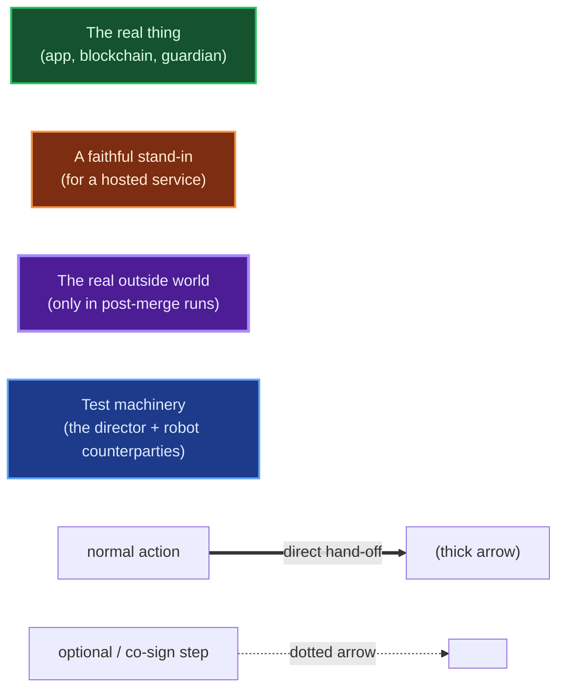
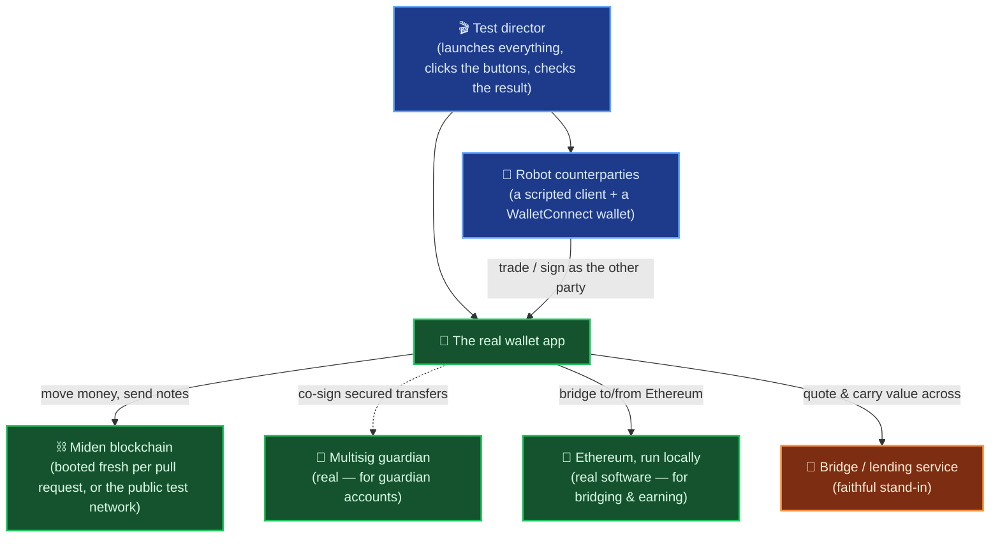
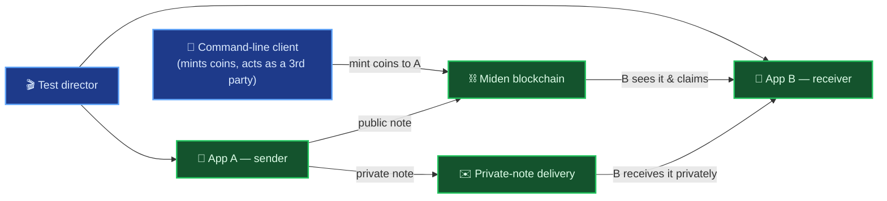
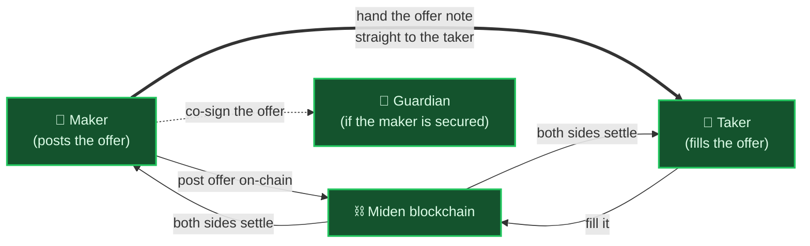
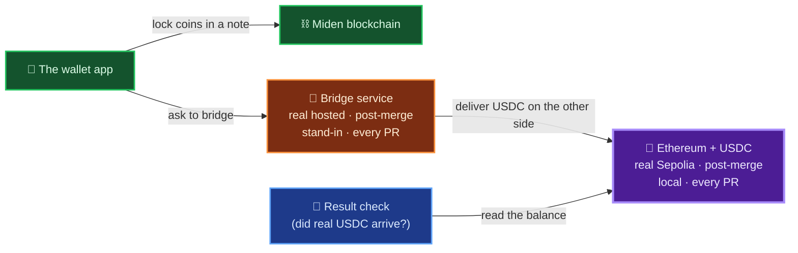
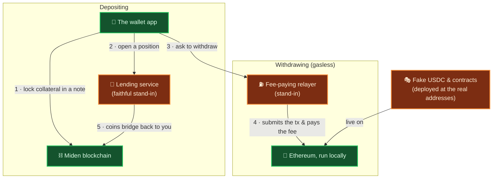
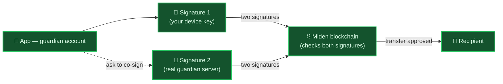
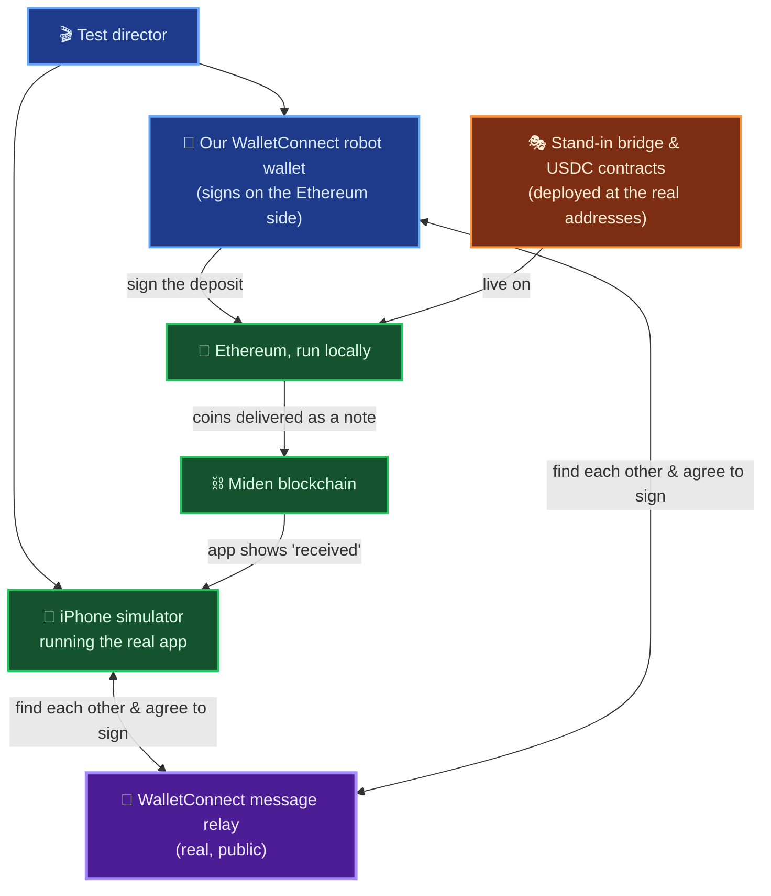

# Inside the Miden Wallet Test Lab

**Who this is for:** engineers who want to understand how we test the wallet — no prior Miden knowledge assumed.

The Miden wallet does something genuinely hard: it moves real money around a **privacy-focused blockchain (Miden)** *and* bridges it to and from **Ethereum**. Proving that works — automatically, on every code change, without a human clicking buttons — is a big challenge.

So we built a **test lab**. The guiding idea:

> **Run the real thing, fake only what we physically can't.**
>
> We never mock the blockchain. On every pull request, our desktop tests boot a *genuine* Miden network in the cloud — the same node software real users rely on — seed it, and drive the *real* wallet app through its *real* screens against it. (The post-merge and mobile tests run that same real app against the genuine public Miden test networks instead.) We add a *real* security co-signer and a *real* local Ethereum for the flows that need them. The only things we stand in for are a handful of **hosted services that live on someone else's servers** — and even those stand-ins are faithful down to the exact addresses and responses the app expects.

This page is a tour of that lab: what each group of tests proves, which pieces are involved, and the parts we're a little proud of.

---

## The cast of characters

A quick glossary so the diagrams make sense:

| Piece | In plain terms |
|---|---|
| **The wallet app** | The actual shipped app — the Chrome extension or the iOS app — built with a few hidden test hooks (stripped from real releases) so the tests can click buttons and read state. Otherwise unchanged. This is what's being tested. |
| **A "note"** | How money moves on Miden. Think of it as a sealed envelope of coins addressed to someone. Notes can be **public** (visible on the chain) or **private** (delivered off to the side). |
| **Proving** | Miden hides transaction details, so instead of *showing* the network what happened, your device computes a cryptographic proof that it followed the rules. That computation — "proving" — is expensive, so it can run on your own machine or be handed to a remote **prover**. |
| **The Miden blockchain** | The privacy chain the wallet lives on — the genuine node software, either booted fresh for the test or the real public test network. |
| **The guardian** | An optional **security co-signer**. A "guardian" account needs *two* signatures to move money — your device *and* a guardian server — so a stolen phone isn't enough. |
| **Bridging** | Moving value between Miden and Ethereum. "Bridge-out" = Miden → Ethereum; "bridge-in" = Ethereum → Miden. |
| **USDC** | A dollar-pegged coin on Ethereum — think digital dollars. It's what value becomes when it lands on the Ethereum side. |
| **Smart contract** | A small program that lives on Ethereum at a fixed address (e.g. the USDC coin, or the bridge). The wallet calls these by address. |
| **The bridge / lending service** | A third-party service ("Epoch") that carries value across the two chains and runs lending. It's hosted on their servers, so most tests use a faithful **stand-in**. |
| **Collateral / position** | To earn yield you lock some coins up as backing ("collateral"); your locked-up stake is a "position." |
| **WalletConnect** | The standard way a wallet and another app agree to sign a transaction together, by passing messages through a shared relay. |
| **The command-line client** | The official Miden client, scripted to act as an **independent other party** — it mints coins, or plays the person on the other end of a trade. |

### How to read the diagrams

**Box color** = how real the piece is (green real · orange stand-in · purple real outside world · blue test machinery). **Arrows:** a solid arrow is a normal action; a **thick** arrow is a direct hand-off; a **dotted** arrow is an optional or co-signing step.

---

## The lab at a glance

Every test assembles the same lab and drives the real app through it. The guardian and Ethereum only join in for the tests that need them:

> ### 🏆 A real blockchain, not a mock
> We don't fake the chain — ever. On every pull request the desktop tests boot a genuine Miden network in the cloud, seed it from scratch, and tear it down afterward. If the wallet talks to the chain correctly, it's because it *actually did*.

---

## Contents

- [1 · Everyday money — send, receive, claim](#1--everyday-money--send-receive-claim)
- [2 · Trading — swaps between two people](#2--trading--swaps-between-two-people)
- [3 · Bridging out — Miden money becomes Ethereum money](#3--bridging-out--miden-money-becomes-ethereum-money)
- [4 · Earning — lending your coins out](#4--earning--lending-your-coins-out)
- [5 · Guardian security — two signatures to move money](#5--guardian-security--two-signatures-to-move-money)
- [6 · Bringing value in on iPhone](#6--bringing-value-in-on-iphone)
- [How real is it, really?](#how-real-is-it-really)

---

## 1 · Everyday money — send, receive, claim

**What these tests prove:** two people can hold the wallet, and money actually moves between them — publicly or privately.

We run **two completely separate copies** of the real app (call them A and B) and a scripted command-line client as an independent third party. The command-line client mints some coins; A claims them and sends some to B — either as a **public** note (posted to the chain) or a **private** note (delivered quietly off to the side). B has to genuinely receive it.

> ### 🏆 Two real wallets, really trading
> Most test suites poke a single app talking to a fake server. Ours runs **two independent copies of the shipped wallet plus the official Miden client as a third party**, all on one real chain — so a "send" is a real end-to-end transfer someone actually receives. We even cover both ways the app can do its proving: handed off to a remote prover, *and* computed entirely inside the browser.

The tests in this group

Create-and-unlock, minting & balances, public send, private send, in-browser proving, claiming several notes at once, multiple accounts, and grouped claims.

---

## 2 · Trading — swaps between two people

**What these tests prove:** one person can post an offer ("10 of coin A for 9 of coin B") and another can fill it — fully, partially, in either direction — or the maker can cancel and get their coins back. It also works when the maker is a **guardian-secured** account.

> ### 🏆 We fixed a real-world timing race
> On a live network, whoever fills an order finds it by watching the chain — but there's a split-second where a freshly-posted order isn't visible yet. Instead of adding flaky "wait and hope" delays, the test **hands the order note directly from the maker to the taker** (the thick arrow above), exactly the way a professional market-making bot would. Reliable, and closer to real trading, not further from it.

The tests in this group

Full fill (both directions), partial fill with remainder, cancel-and-reclaim, create-form validation, a guardian-secured maker, and a smoke test.

---

## 3 · Bridging out — Miden money becomes Ethereum money

**What these tests prove:** you can send value *out* of Miden and have it arrive on Ethereum as USDC.

This runs at **two levels of realism**:

- **Post-merge (after every merge to main):** against the **real** hosted bridge service and the **real** Ethereum test network (Sepolia) — and we then check that **actual USDC really shows up** at the destination.
- **Every pull request:** a fully self-contained version using a **stand-in** bridge service and a **local** Ethereum, so the guardian-secured bridge path is checked on every commit.

(There are also two bridge *routes*: a **fast** one, via the Epoch service, and a **slower** one via a bridge network called **AggLayer** — both covered.)

> ### 🏆 We follow the money all the way to Ethereum
> The post-merge test doesn't stop at "the app said it worked." It bridges real value and then **reads the destination wallet on a real Ethereum test network to confirm the USDC actually landed.** That's the strongest possible proof a bridge works.

> ### 🏆 An on-chain "note inspector" that caught a real bug
> The bridge service is picky about the *exact shape* of the coin-note the wallet hands it. We built a check that reads the note straight off the chain and verifies its shape is exactly right. It catches a category of mistake that once slipped into a release (a guardian bridge quietly minting the wrong kind of note) — now it can't happen silently again.

The tests in this group

Fast bridge (real USDC on Sepolia, post-merge), the slower AggLayer route, and a guardian-secured bridge that runs fully offline on every pull request.

---

## 4 · Earning — lending your coins out

**What these tests prove:** you can deposit coins as collateral to earn yield, and later withdraw — including a **gasless** withdrawal where someone else pays the Ethereum fee.

Because the lending service is hosted on someone else's servers, this whole flow runs against **stand-ins**: a faithful fake of the lending service, plus a **local** Ethereum with convincing fake versions of the relevant contracts.

> ### 🏆 A "gasless" withdrawal, faked convincingly offline
> Normally you pay a fee to move money on Ethereum. This flow uses a brand-new Ethereum feature (account "delegation") to let a **relayer pay the fee for you**. We reproduce that flow — the delegation, the relayer, the token contracts — with local stand-ins, so a genuinely cutting-edge feature is tested without touching a real network or spending a cent.

The tests in this group

Deposit collateral and confirm the position opens; withdraw a funded position gasless-ly and confirm the coins bridge back.

---

## 5 · Guardian security — two signatures to move money

**What these tests prove:** a "guardian" account — one that needs **two signatures** (your device *and* a guardian server) — can still fund, claim, and send. A stolen device alone can't move the money.

The clever part: we don't fake the guardian. Each test can spin up the **real guardian server** (the same software that protects real users) and do the genuine two-signature handshake.

> ### 🏆 Real multisig security, tested on every change
> Standing up a real co-signing server in an automated test is unusual. We do it — so the "two signatures to move money" promise is verified against the actual guardian software, not a stub. This is the foundation the guardian **trade** and **bridge** tests build on too.

The tests in this group

A guardian account funds, claims notes, and sends to a normal wallet — every step co-signed for real.

---

## 6 · Bringing value in on iPhone

**What these tests prove:** on an **iPhone**, you can bring value *in* from Ethereum. The app connects to an Ethereum wallet via WalletConnect, that wallet signs a deposit, and the coins arrive on Miden.

There's a chicken-and-egg problem: to test "connect to another wallet and have it sign," you'd normally need a *second real wallet and a human*. So we built one.

> ### 🏆 We built a robot Ethereum wallet that speaks WalletConnect
> To be the other party in a cross-chain deal, the test needs an Ethereum wallet on the far side. So we built a **robot wallet** that speaks the real WalletConnect protocol: it pairs with the app over the genuine public WalletConnect relay, approves the session, and **signs real Ethereum transactions** — with no human and no MetaMask anywhere in the loop. (The signed transactions go to our local Ethereum, not the real one.)

> ### 🏆 Driving the real app on a real iPhone (well, simulator)
> These tests run on **actual iPhone simulators** — two of them, so the two-wallets story works on mobile too — and reach inside the app's screen the way a developer's debugger would, tapping real buttons and reading real state. Some buttons even live *outside* the web page, in the phone's own native interface; we built a special hook so the test can press those too.

> ### 🏆 Convincing fakes that enforce the real rules
> Ethereum contracts live at fixed addresses. Our stand-ins for the bridge and USDC are deployed at **the exact same addresses the app expects** — so the app runs its real bridging code, unaware anything is a test. And the fakes aren't pushovers: the bridge stand-in *rejects* a malformed deposit on-chain, and the test decodes the app's actual transaction to confirm it asked for exactly the right thing. A bug can't pass by doing *something* — it has to do the *right* thing.

> ⚠️ **Honest status:** this mobile bridge-in suite is still being hardened (the shared WalletConnect relay is flaky on our free tier) and the feature ships behind a flag, so it isn't yet a blocking gate. The harness engineering above is built and in place.

The tests in this group

Bridge-in via the two routes, a WalletConnect-pairing-only check, a delivery-only check, and the guardian flow — all on iPhone. (An Android two-emulator harness also exists in the codebase, not yet wired into CI.)

---

## How real is it, really?

The honest breakdown of what's genuine versus stood-in:

| Layer | In the test lab | |
|---|---|---|
| **The wallet app** | the real, shipped app (built with test-observation hooks, stripped from releases) | ✅ real |
| **The Miden blockchain** | booted fresh per run for pull-request tests; the genuine public test network otherwise | ✅ real |
| **The proving (cryptography)** | both the remote and in-browser paths | ✅ real |
| **Private-note delivery** | the real delivery service | ✅ real |
| **The guardian co-signer** | the real guardian server | ✅ real |
| **The independent counterparty** | the official command-line client | ✅ real |
| **WalletConnect** | the real app ↔ real public relay ↔ our robot wallet | ✅ real link, 🎭 robot far side |
| **Ethereum** | genuine Ethereum software, run locally (for bridging & earning) | ✅ real (local) |
| **Ethereum contracts (bridge, USDC…)** | faithful fakes at the *real* addresses, enforcing real rules | 🎭 stand-in |
| **The hosted bridge service** | real in post-merge bridge runs; stand-in per pull request | 🌍 real / 🎭 stand-in |
| **The hosted lending service** | always a stand-in | 🎭 stand-in |
| **Money actually arriving on Ethereum (post-merge bridge)** | real USDC on a real test network | ✅ real |

> **The short version:** the app, the blockchain, the cryptography, the security co-signer, and the counterparty are all *real*. We stand in only for the outside services we can't run ourselves — and we make those stand-ins convincing enough, at the real addresses and enforcing the real rules, that the app never knows the difference.
