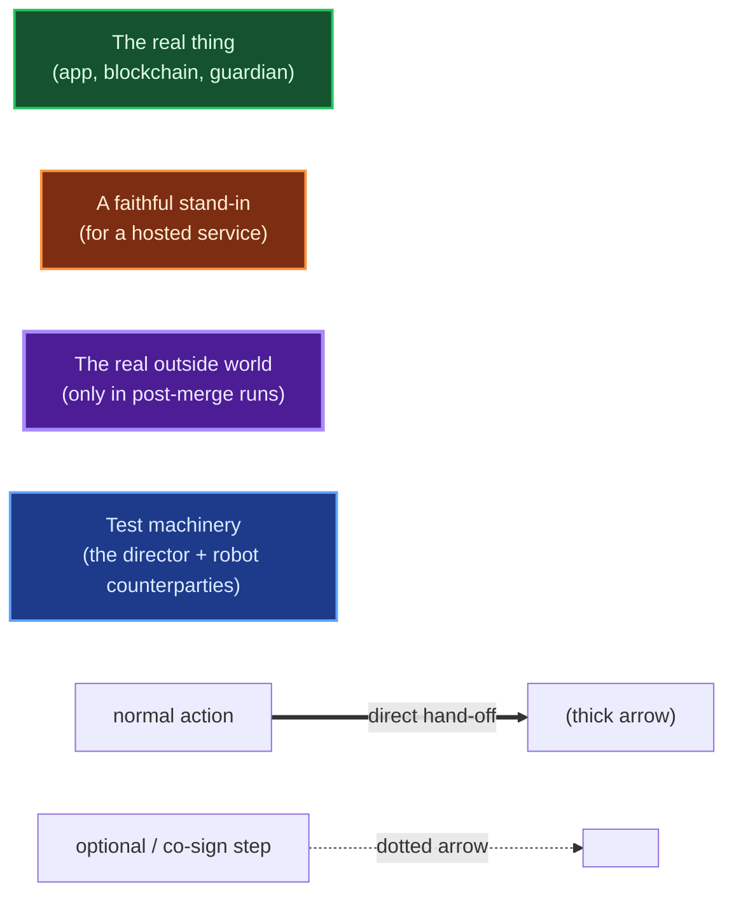
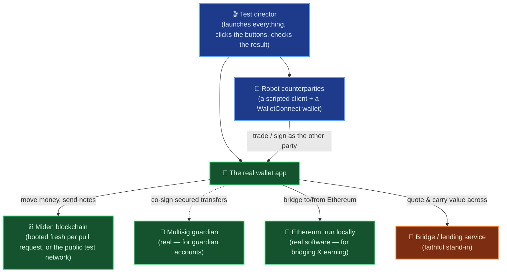
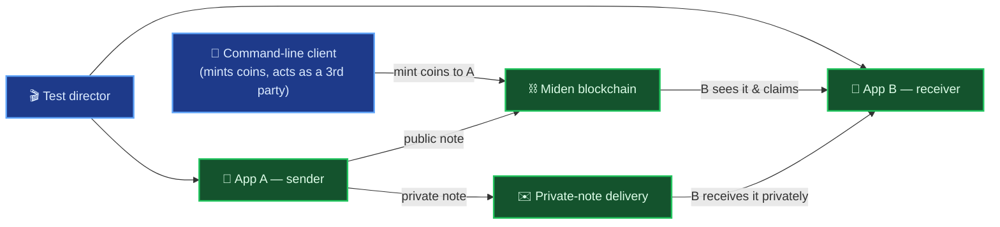
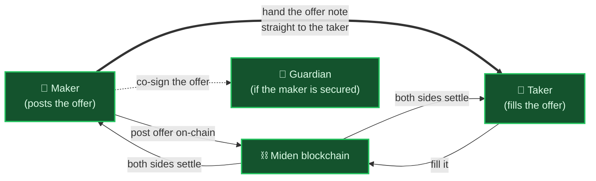
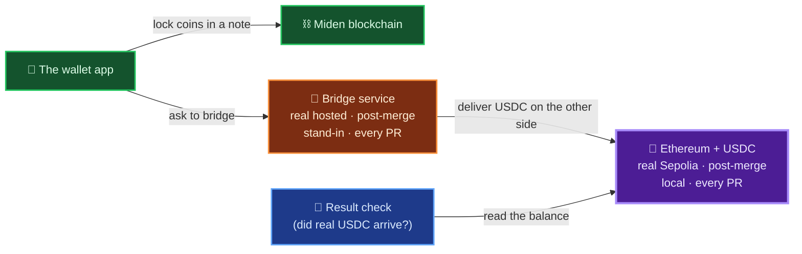
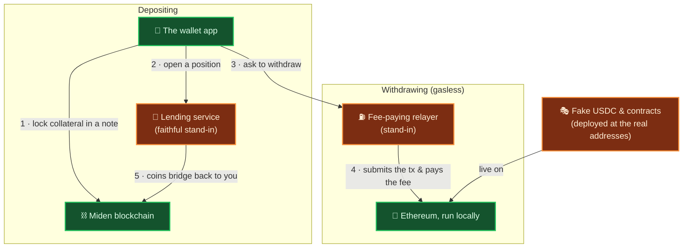
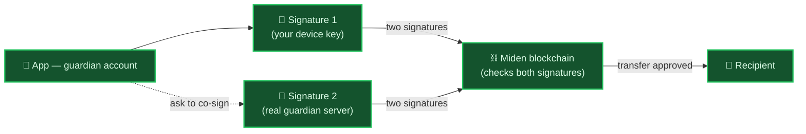
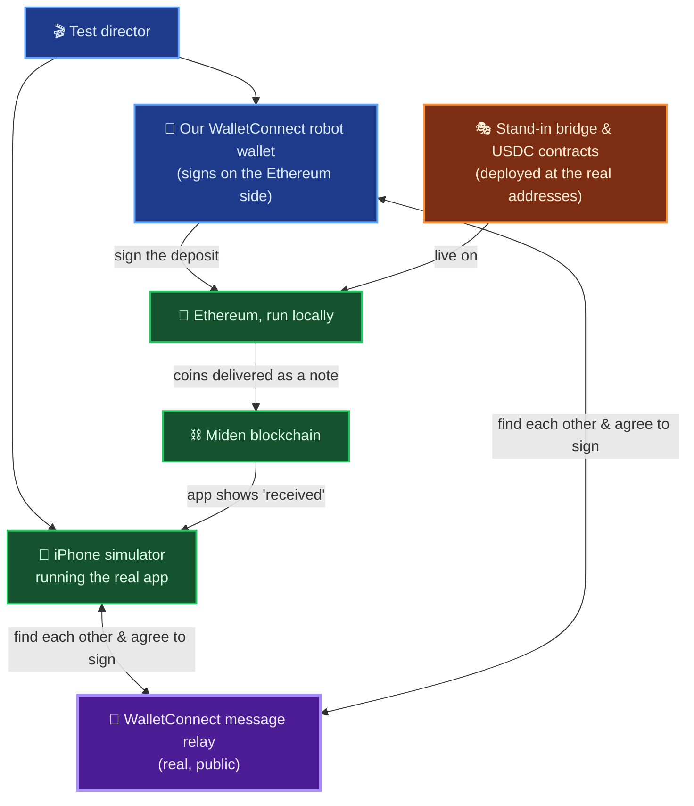
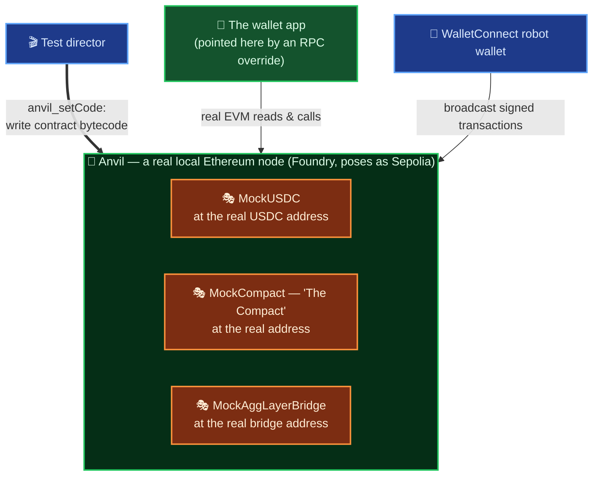

# Inside the Miden Wallet Test Lab

**Who this is for:** engineers who want to understand how the wallet is tested end to end — no prior Miden knowledge assumed.

The Miden wallet moves real value across two very different systems: a **privacy-focused blockchain (Miden)** and **Ethereum**. Cross-chain money movement is unforgiving — a note delivered in the wrong shape, signatures gathered in the wrong order, or a bridge that reports success without settling can each cost real funds. Verifying that the wallet gets this right, automatically and on every change, is the job of the end-to-end (E2E) test harness described here.

The harness is organized around a single principle:

> **Run the real thing; stand in only for what can't be run in CI.**
>
> The blockchain is never mocked. On every pull request, the desktop suites boot a genuine Miden network in CI — the same node software real users rely on — seed it from a fresh genesis, and drive the actual wallet app through its real screens against it. The post-merge and mobile suites run that same app against the genuine public Miden test networks. A real security co-signer and a real (local) Ethereum node are added for the flows that need them. The only components stood in for are a handful of **third-party services hosted on external servers** — and those stand-ins are built to match the real services' addresses and responses closely enough that the app cannot tell the difference.

The rest of this page walks through each group of tests: what it verifies, which components take part, and the design choices worth noting.

---

## The cast of characters

A short glossary so the diagrams read clearly:

| Piece | In plain terms |
|---|---|
| **The wallet app** | The actual shipped app — the Chrome extension or the iOS app — built with a few hidden test hooks (stripped from real releases) so the tests can click buttons and read state. Otherwise unchanged. This is what's being tested. |
| **A "note"** | How money moves on Miden. Think of it as a sealed envelope of coins addressed to someone. Notes can be **public** (visible on the chain) or **private** (delivered off to the side). |
| **Proving** | Miden hides transaction details, so instead of *showing* the network what happened, your device computes a cryptographic proof that it followed the rules. That computation — "proving" — is expensive, so it can run on your own machine or be handed to a remote **prover**. |
| **The Miden blockchain** | The privacy chain the wallet lives on — the genuine node software, either booted fresh for the test or the real public test network. |
| **The guardian** | An optional **security co-signer**. A "guardian" account needs *two* signatures to move money — your device *and* a guardian server — so a stolen phone isn't enough. |
| **Bridging** | Moving value between Miden and Ethereum. "Bridge-out" = Miden → Ethereum; "bridge-in" = Ethereum → Miden. |
| **USDC** | A dollar-pegged coin on Ethereum — think digital dollars. It's what value becomes when it lands on the Ethereum side. |
| **Smart contract** | A small program that lives on Ethereum at a fixed address (e.g. the USDC coin, or the bridge). The wallet calls these by address. |
| **The bridge / lending service** | A third-party service ("Epoch") that carries value across the two chains and runs lending. It's hosted on their servers, so most tests use a faithful **stand-in**. |
| **Collateral / position** | To earn yield you lock some coins up as backing ("collateral"); your locked-up stake is a "position." |
| **WalletConnect** | The standard way a wallet and another app agree to sign a transaction together, by passing messages through a shared relay. |
| **The command-line client** | The official Miden client, scripted to act as an **independent other party** — it mints coins, or plays the person on the other end of a trade. |

### How to read the diagrams

**Box color** = how real the piece is (green real · orange stand-in · purple real outside world · blue test machinery). **Arrows:** a solid arrow is a normal action; a **thick** arrow is a direct hand-off; a **dotted** arrow is an optional or co-signing step.

---

## The lab at a glance

Every suite assembles the same set of components and drives the real app through them. The guardian and Ethereum take part only in the tests that require them:

> #### A real blockchain, not a mock
> The chain is never faked. On every pull request the desktop suites boot a genuine Miden network in CI, seed it from a fresh genesis, and tear it down afterward. When the wallet syncs, submits, or reads balances, it does so against real node software — so a passing test reflects real on-chain behaviour rather than a mock's assumptions.

---

## Contents

- [1 · Everyday money — send, receive, claim](#1--everyday-money--send-receive-claim)
- [2 · Trading — swaps between two people](#2--trading--swaps-between-two-people)
- [3 · Bridging out — Miden money becomes Ethereum money](#3--bridging-out--miden-money-becomes-ethereum-money)
- [4 · Earning — lending your coins out](#4--earning--lending-your-coins-out)
- [5 · Guardian security — two signatures to move money](#5--guardian-security--two-signatures-to-move-money)
- [6 · Bringing value in on iPhone](#6--bringing-value-in-on-iphone)
- [Under the hood — running Ethereum locally](#under-the-hood--running-ethereum-locally)
- [How real is it, really?](#how-real-is-it-really)

---

## 1 · Everyday money — send, receive, claim

**What these tests verify:** two independent people can hold the wallet and move money between them, publicly or privately.

The harness runs two completely separate copies of the real app — instances A and B — alongside the official Miden command-line client acting as an independent third party. The command-line client mints some coins; instance A claims them and sends some to B, either as a **public** note (posted to the chain) or a **private** note (delivered through the off-chain transport service). B then has to genuinely receive and claim it. Running two real instances, rather than one app against a mock, means every send is a true end-to-end transfer with a real recipient on the other side.

> #### Two independent wallets on one chain
> Many test suites exercise a single app against a mocked backend. This suite runs two independent copies of the shipped wallet, plus the official Miden client as a third party, all against one real chain — so a "send" is a genuine end-to-end transfer that another party receives. Both of the app's proving paths are covered: proofs handed to a remote prover, and proofs computed entirely in the browser.

The tests in this group

Create-and-unlock, minting & balances, public send, private send, in-browser proving, claiming several notes at once, multiple accounts, and grouped claims.

---

## 2 · Trading — swaps between two people

**What these tests verify:** a maker can post an offer ("10 of coin A for 9 of coin B") and a taker can fill it — fully, partially, or in the opposite direction — and an unfilled offer can be cancelled and reclaimed. The same flow is also exercised with a **guardian-secured** maker, so multi-signature accounts are covered on the trading path.

> #### Handling the order-discovery timing race
> On a live network, a taker discovers an order by watching the chain — but there is a brief window after an order is posted before it becomes visible. Rather than paper over this with fixed "wait and hope" delays (which make tests slow and flaky), the harness hands the order note directly from the maker to the taker (the thick arrow above), the same approach a production market-making bot uses. The result is deterministic and, if anything, closer to real trading behaviour than a polling loop would be.

The tests in this group

Full fill (both directions), partial fill with remainder, cancel-and-reclaim, create-form validation, a guardian-secured maker, and a smoke test.

---

## 3 · Bridging out — Miden money becomes Ethereum money

**What these tests verify:** value can be sent *out* of Miden and arrive on Ethereum as USDC.

The flow is exercised at **two levels of realism**, each suited to a different point in the pipeline:

- **Post-merge (after every merge to main):** against the **real** hosted bridge service and the **real** Ethereum test network (Sepolia). The test then confirms that **actual USDC arrives** at the destination — an end-to-end check that includes the third-party solver settling the Ethereum side.
- **Every pull request:** a fully self-contained version using a **stand-in** bridge service and a **local** Ethereum node, so the guardian-secured bridge path is verified on every commit without depending on external infrastructure.

There are also two bridge *routes* — a **fast** one via the Epoch service and a **slower** one via a bridge network called **AggLayer** — and both are covered.

> #### Verifying settlement on Ethereum
> The post-merge test does not stop at the app reporting success. After bridging, it reads the destination account on a real Ethereum test network and confirms the USDC balance actually increased. This validates the entire path — including the external solver that settles the Ethereum side — so the app cannot pass merely by believing it succeeded.

> #### On-chain verification of the minted note
> The bridge service accepts only a specific shape of collateral note. The harness reads the committed note directly from the chain and verifies its type and structure are exactly what the service requires. This check was added after a defect — a guardian bridge minting the wrong kind of note — reached a release; with the check in place, that class of mistake now fails a test rather than shipping silently.

The tests in this group

Fast bridge (real USDC on Sepolia, post-merge), the slower AggLayer route, and a guardian-secured bridge that runs fully offline on every pull request.

---

## 4 · Earning — lending your coins out

**What these tests verify:** coins can be deposited as collateral to earn yield, and later withdrawn — including a **gasless** withdrawal in which someone else pays the Ethereum fee.

Because the lending service is hosted on external servers, this flow runs entirely against **stand-ins**: a faithful fake of the lending service, plus a **local** Ethereum node carrying stand-in versions of the relevant contracts. The point is to exercise the wallet's real deposit and withdraw logic against services that behave like the real ones.

> #### Reproducing a gasless (sponsored) withdrawal offline
> Moving funds on Ethereum normally requires the sender to pay a fee. This flow uses a recent Ethereum feature (account "delegation") so that a relayer pays the fee on the user's behalf. The harness reproduces the full sequence — the delegation, the relayer, and the token contracts — against local stand-ins, so this relatively new mechanism is exercised on every relevant change without touching a live network or spending funds.

The tests in this group

Deposit collateral and confirm the position opens; withdraw a funded position gasless-ly and confirm the coins bridge back.

---

## 5 · Guardian security — two signatures to move money

**What these tests verify:** a "guardian" account — one that requires **two signatures** (your device *and* a guardian server) — can still fund, claim, and send. A stolen device alone cannot move the money.

The notable part is that the guardian is not faked. Each of these tests can start the **real guardian server** — the same software that protects production accounts — and perform the genuine two-signature handshake, rather than asserting against a stub.

> #### Testing against a real co-signing server
> Running an actual co-signing server inside an automated test is uncommon; this harness does it. Each guardian test can start the real guardian server and complete the real two-signature handshake, so the "two signatures to move money" guarantee is verified against the production co-signer rather than a stub. This co-signing path is also the foundation the guardian **trade** and **bridge** tests build on.

The tests in this group

A guardian account funds, claims notes, and sends to a normal wallet — every step co-signed for real.

---

## 6 · Bringing value in on iPhone

**What these tests verify:** on iOS, value can be brought *in* from Ethereum. The app connects to an Ethereum wallet over WalletConnect, that wallet signs a deposit, and the resulting funds arrive on Miden.

Testing "connect to another wallet and have it sign" would normally require a second real wallet and a person to operate it. The harness removes that dependency by providing the counterparty itself.

> #### A headless Ethereum wallet that speaks WalletConnect
> To act as the far side of a cross-chain deposit, the harness includes a headless Ethereum wallet that implements the real WalletConnect protocol. It pairs with the app over the genuine public WalletConnect relay, approves the session, and signs Ethereum transactions — with no person and no browser extension involved. The signed transactions are submitted to the local Ethereum node rather than a live network.

> #### Driving the real app on iOS simulators
> These tests run on iOS simulators — two of them, so the two-wallet scenarios apply on mobile as well — and interact with the app the way a debugger would, tapping real controls and reading real state. Some controls render outside the web view, in the phone's native interface; a dedicated hook lets the tests operate those too.

> #### Stand-in contracts that enforce real invariants
> Ethereum contracts live at fixed addresses. The stand-ins for the bridge and USDC are deployed at the exact addresses the app expects, so the app runs its real bridging code unchanged. These stand-ins are not permissive: the bridge stand-in rejects a malformed deposit on-chain, and the test decodes the app's actual transaction to confirm it requested precisely the right operation. A defect cannot pass by doing something plausible — it has to do the correct thing.

> **Status:** the mobile bridge-in suite is still being stabilised — the shared WalletConnect relay is unreliable on the current free tier — and the feature ships behind a flag, so this suite is not yet a required gate. The harness components described above are implemented and in place.

The tests in this group

Bridge-in via the two routes, a WalletConnect-pairing-only check, a delivery-only check, and the guardian flow — all on iPhone. (An Android two-emulator harness also exists in the codebase, not yet wired into CI.)

---

## Under the hood — running Ethereum locally

Several flows — bridging, earning, and the iPhone bridge-in — need an Ethereum chain to talk to. Rather than depend on the public Ethereum test network (which is slow, shared, and occasionally down), those suites run their own Ethereum locally. This section explains how that works.

### A real Ethereum node, not a simulator

The local chain is **Anvil**, the EVM node that ships with Foundry. It is a genuine Ethereum implementation — it executes transactions, reverts on bad input, and keeps real state — simply running on the test machine. The harness starts it on `127.0.0.1:8545` and gives it **chain id 11155111**, which is Sepolia's id, so the wallet believes it is talking to the Sepolia test network. (On iOS the simulator shares the host's network stack, so that same `127.0.0.1:8545` is reachable from both the test process and the app's web view.)

The wallet is aimed at this node by a build-time setting — an RPC-URL override compiled into the test build — so all of its Ethereum reads and writes go to Anvil instead of the public network. Nothing in the wallet's Ethereum code is stubbed: it runs exactly as it would in production, and only the chain it connects to is local.

### Supplying the contracts the app expects

A wallet on Ethereum talks to **smart contracts** — small on-chain programs at fixed addresses — for things like the USDC coin and the bridge. The real versions live on public networks and can't be copied onto a local chain, so the harness deploys its own stand-ins. It does this with an Anvil capability called **`anvil_setCode`**, which writes a contract's compiled bytecode directly to any address, with no deployment transaction needed.

The important detail is *where*: each stand-in is placed at the **exact address the wallet hardcodes for the real contract**. Because the address matches, the wallet's real code calls the stand-in with no special-casing — it cannot tell the difference.

Three contracts are supplied this way (compiled from short Solidity sources kept in the repo):

- **MockUSDC**, at the real USDC address — a minimal ERC-20 stand-in. It reports a balance for the deposit screen, returns a maximum allowance (so the deposit path skips its `approve` step), and lets transfers succeed so the other contracts can pull funds.
- **MockCompact** ("The Compact"), at the address the bridge/lending SDK expects. It answers a status check with "withdrawals not forced" — which the deposit flow requires before it will proceed — and its deposit function verifies it received the expected token, pulls it in, and counts the deposit.
- **MockAggLayerBridge**, at the real AggLayer bridge address. It implements the real bridge function's signature *and its rule that a native-ETH deposit must carry exactly the stated amount* — so a malformed deposit **reverts on-chain** and the wallet marks the transaction failed, rather than passing against an empty address.

### Seeding an account "delegation" for the gasless withdraw

The gasless withdraw relies on a recent Ethereum feature (EIP-7702 account delegation) that lets an ordinary account behave like a smart account, so a relayer can pay its fee. Establishing that delegation normally requires a special signed transaction that the stand-in relayer can't broadcast. Instead, the harness uses `anvil_setCode` again to write the delegation marker directly onto the owner's account, so the wallet sees the account as already delegated and continues down the gasless path.

### Why this is trustworthy, not a shortcut

Deploying byte-for-byte contracts at the real addresses, on a real EVM that reports Sepolia's identity, means the wallet's Ethereum code runs unchanged and unaware. The stand-ins deliberately enforce the real invariants — the bridge reverts on a wrong-value deposit, the Compact rejects an unexpected token — so a defect fails a test rather than slipping through against permissive dead code. Where a test needs to confirm that something happened, it reads counters the stand-ins keep (for example, how many deposits were registered) and decodes the wallet's actual transaction data to check it requested precisely the right operation. The signing itself — ordinary Ethereum transactions, and the 7702 authorization — is entirely real.

Concrete details (addresses &amp; mechanism)

- **Anvil:** `127.0.0.1:8545`, chain id `11155111` (Sepolia), started via Foundry's `anvil`; the wallet is pointed at it by the `E2E_EVM_RPC_URL` build override.
- **Contracts installed via `anvil_setCode`** (runtime bytecode written directly at fixed addresses):

  | Stand-in | Address (matches the app's hardcoded value) | Role |
  |---|---|---|
  | MockUSDC | `0x2BB4FfD7E2c6D432b697554Efd77fA13bdbefd69` | balance read; MAX allowance (skips `approve`); transfers succeed |
  | MockCompact | `0x00000000000000171ede64904551eeDF3C6C9788` | `getForcedWithdrawalStatus → Disabled`; `depositERC20AndRegister` asserts the token, pulls it, counts deposits |
  | MockAggLayerBridge | `0x1348947e282138d8f377b467f7d9c2eb0f335d1f` | real `bridgeAsset` signature + `msg.value == amount` invariant → reverts on a malformed deposit |

- **EIP-7702 delegation** for the gasless withdraw is seeded by writing `0xef0100` + the approved implementation address at the owner account (again via `anvil_setCode`), so the SDK sees the account as already delegated.
- Sources: `playwright/e2e/ios/helpers/anvil.ts`, `playwright/e2e/ios/helpers/evm-doubles.ts`, `playwright/e2e/ios/helpers/contracts/*.sol`.

---

## How real is it, really?

The following summarises what is genuine versus stood in:

| Layer | In the test lab | |
|---|---|---|
| **The wallet app** | the real, shipped app (built with test-observation hooks, stripped from releases) | ✅ real |
| **The Miden blockchain** | booted fresh per run for pull-request tests; the genuine public test network otherwise | ✅ real |
| **The proving (cryptography)** | both the remote and in-browser paths | ✅ real |
| **Private-note delivery** | the real delivery service | ✅ real |
| **The guardian co-signer** | the real guardian server | ✅ real |
| **The independent counterparty** | the official command-line client | ✅ real |
| **WalletConnect** | the real app ↔ real public relay ↔ the harness's robot wallet | ✅ real link, 🎭 robot far side |
| **Ethereum** | genuine Ethereum software, run locally (for bridging & earning) | ✅ real (local) |
| **Ethereum contracts (bridge, USDC…)** | faithful fakes at the *real* addresses, enforcing real invariants | 🎭 stand-in |
| **The hosted bridge service** | real in post-merge bridge runs; stand-in per pull request | 🌍 real / 🎭 stand-in |
| **The hosted lending service** | always a stand-in | 🎭 stand-in |
| **Money actually arriving on Ethereum (post-merge bridge)** | real USDC on a real test network | ✅ real |

> **In summary:** the app, the blockchain, the cryptography, the co-signer, and the counterparty client are all real. The harness stands in only for the external services it cannot run itself, and it builds those stand-ins at the real addresses and to the real invariants — so the app behaves the same as it would in production.
